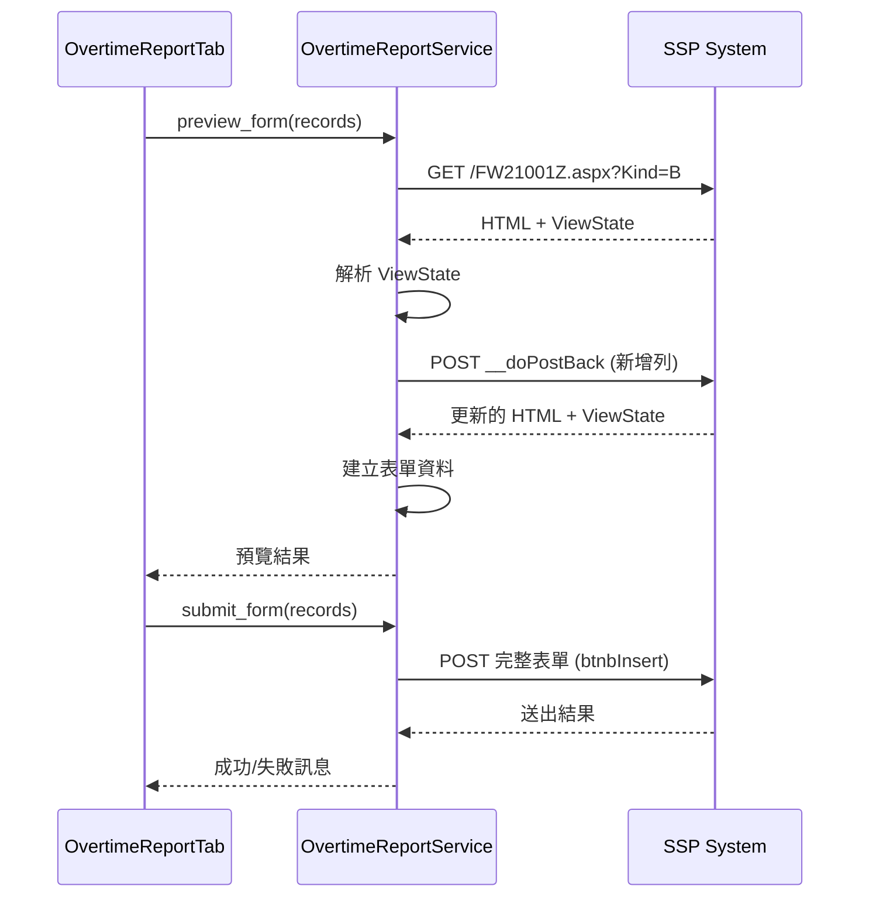

# Release Notes v1.2.0-beta

> **發布日期**: 2025/11/26  
> **版本狀態**: Beta 測試版  
> **版本號**: `1.2.0-beta`  
> **版本名稱**: "加班補報自動填寫 (預覽版)"

---

## 🎯 版本概述

這是一個重大功能更新版本,新增了**加班補報自動填寫**功能,可以自動填寫 SSP 系統的加班補報申請單,大幅節省人工操作時間。本版本採用 Beta 測試模式,送出功能預設關閉,建議先使用預覽功能測試。

---

## ✨ 重大新功能

### 1. ⚙️ 加班補報自動填寫

自動將出勤異常記錄填寫至 SSP 加班補報申請單。

#### 核心功能
- **智慧記錄載入**: 自動載入有加班時數的記錄
- **勾選機制**: 自由選擇要送出的記錄
- **已申請狀態**: 自動查詢並標記已申請/審核中的記錄
- **可編輯內容**: 
  - 加班內容 (預設: "加班作業")
  - 加班/調休選擇
- **表單預覽**: 送出前預覽要填寫的內容
- **一鍵送出**: 批次送出所有勾選記錄

#### 技術實現
```python
# 服務層
OvertimeStatusService     # 查詢已申請記錄
OvertimeReportService     # 填寫並送出表單

# 資料模型
OvertimeSubmissionRecord  # 補報記錄 (UI 用)
SubmittedRecord          # 已申請記錄 (查詢結果)
OvertimeSubmissionStatus # 狀態列舉

# UI 元件
OvertimeReportTab        # 加班補報分頁
```

#### ASP.NET 表單處理
本功能正確處理 ASP.NET WebForms 的複雜機制:
- ✅ **ViewState 保持**: 每次 PostBack 都保留狀態
- ✅ **動態新增列**: 使用 `__doPostBack('lbgvAddRowi', '')` 
- ✅ **欄位命名**: `txtOT_Datei`, `txtOT_Describei` (i = 索引從 3 開始)
- ✅ **分鐘轉換**: 自動將小時轉換為分鐘數
- ✅ **送出按鈕**: `btnbInsert` 觸發表單提交

---

### 2. 📋 已申請狀態查詢

自動查詢 SSP 系統中已申請的加班記錄。

#### 功能特點
- **多頁查詢**: 自動抓取所有分頁資料 (最多 10 頁)
- **狀態解析**: 解析「簽核中」、「簽核完成」等狀態
- **智慧標記**: 已申請的記錄自動禁用勾選框
- **即時更新**: 點擊「重新整理」可重新查詢

#### 查詢來源
- 頁面: `FW21003Z.aspx`
- 表格: `ContentPlaceHolder1_gvFlow211`
- 分頁: `FlowPagerStyle` 自動解析頁數

---

### 3. 🎯 分頁式介面重構

主視窗重構為分頁模式,提供更清晰的功能區分。

#### 分頁配置
```
主視窗
├── 導覽列 (Logo + 使用者 + 登出)
├── 統計卡片區域 (全域顯示)
│   ├── 📅 總筆數
│   ├── ⏱️ 總加班時數
│   ├── 📊 平均加班時數
│   └── 🔥 最高加班時數
└── 分頁介面
    ├── ⚙️ 加班補報 (預設)
    │   ├── 操作按鈕區 (預覽、送出、重新整理)
    │   └── 記錄列表 (勾選框、日期、內容、時數、類型、狀態)
    └── 📅 異常清單
        ├── 操作按鈕區 (複製、匯出)
        └── 出勤表格 (可排序、可複製)
```

#### UI 優化
- ✅ 統計卡片提升至主視窗層級,所有分頁共享
- ✅ 移除冗餘的狀態訊息區,改用對話框
- ✅ 載入狀態提示: "⏳ 正在載入加班記錄..."
- ✅ 空狀態提示: "📝 目前沒有待補報的加班記錄"

---

## 🔧 技術改進

### 新增服務層 (Services)

#### `OvertimeStatusService`
```python
class OvertimeStatusService:
    def fetch_submitted_records(session) -> Dict[str, SubmittedRecord]
    def _parse_status_table(html) -> List[SubmittedRecord]
    def _fetch_status_page(session, page_num) -> BeautifulSoup
    def _get_total_pages(soup) -> int
```

**職責**: 查詢已申請的加班記錄  
**特點**: 支援分頁、自動解析狀態文字、錯誤處理

#### `OvertimeReportService`
```python
class OvertimeReportService:
    def preview_form(session, records) -> Dict[str, Any]
    def submit_form(session, records) -> Dict[str, Any]
    def _add_form_rows(session, count) -> BeautifulSoup
    def _build_form_data(soup, records) -> Dict[str, str]
```

**職責**: 填寫並送出加班補報表單  
**特點**: ViewState 管理、動態新增列、表單驗證

---

### 新增資料模型 (Models)

#### `OvertimeSubmissionRecord`
```python
@dataclass
class OvertimeSubmissionRecord:
    date: str                       # 加班日期
    description: str                # 加班內容 (可編輯)
    overtime_hours: float           # 加班時數
    is_overtime: bool = True        # True=加班, False=調休
    is_selected: bool = True        # 是否勾選
    submitted_status: Optional[str] = None  # 已申請狀態
    
    @property
    def is_submitted(self) -> bool
    @property
    def overtime_minutes(self) -> int
    @property
    def change_minutes(self) -> int
```

#### `SubmittedRecord`
```python
@dataclass
class SubmittedRecord:
    date: str                  # 加班日期
    status: str                # 狀態文字
    overtime_minutes: float    # 加班分鐘數
    change_minutes: float      # 調休分鐘數
    
    @property
    def is_overtime(self) -> bool
```

#### `OvertimeSubmissionStatus` (Enum)
```python
class OvertimeSubmissionStatus(Enum):
    NOT_SUBMITTED = "未申請"
    SUBMITTED = "已申請"
    IN_REVIEW = "簽核中"
    APPROVED = "簽核完成"
    REJECTED = "已撤回"
```

---

### 新增 UI 元件 (Components)

#### `OvertimeReportTab`
加班補報分頁,提供記錄勾選、編輯、預覽、送出功能。

**主要功能**:
- `load_data(session, submission_records, submitted_records)`: 載入資料
- `on_preview()`: 預覽表單
- `on_submit()`: 送出申請
- `on_refresh()`: 重新整理狀態
- `_create_record_item(record)`: 建立記錄卡片

**UI 結構**:
```
OvertimeReportTab
├── Header (操作按鈕: 預覽 | 送出 | 重新整理)
├── Loading Container (載入提示)
└── Records Container (CTkScrollableFrame)
    └── Record Cards (勾選框 + 日期 + 內容 + 時數 + 類型 + 狀態)
```

#### `AttendanceTab`
出勤異常清單分頁,重構自原 `ReportFrame`。

**主要功能**:
- `display_report(report)`: 顯示報表
- `copy_total_hours()`: 複製總時數
- `on_export()`: 匯出 Excel

---

### 配置更新 (Config)

`src/config/settings.py`:
```python
@dataclass
class Settings:
    # 新增 URL
    OVERTIME_REPORT_URL: str = "/FW21001Z.aspx?Kind=B"  # 加班補報申請單
    OVERTIME_STATUS_URL: str = "/FW21003Z.aspx"         # 已申請狀態查詢
    
    # 新增設定
    DEFAULT_OVERTIME_DESCRIPTION: str = "加班作業"
```

---

## ✅ 測試覆蓋

### 新增測試檔案
- `tests/test_overtime_submission.py`: 11 個測試

### 測試內容
1. **OvertimeSubmissionStatus 列舉**: 狀態值正確性
2. **OvertimeSubmissionRecord**:
   - 記錄建立
   - 加班/調休分鐘數轉換
   - 已申請狀態判斷
3. **SubmittedRecord**:
   - 已申請記錄建立
   - 加班/調休類型判斷
4. **OvertimeReport 轉換**:
   - `to_submission_records()` 轉換邏輯
   - 自訂加班內容
   - 空報表處理
   - 無加班記錄處理

### 測試結果
```bash
pytest tests/test_overtime_submission.py
================= 11 passed =================
```

---

## 🚨 Beta 版本限制

### 送出功能預設關閉
為確保安全,Beta 版本預設**不會送出**表單:

```python
# src/services/overtime_report_service.py
ENABLE_SUBMISSION = False  # Beta 版本關閉送出功能
```

### 啟用方式
1. 修改 `overtime_report_service.py`:
   ```python
   ENABLE_SUBMISSION = True
   ```
2. 重新啟動程式
3. 點擊「送出申請」即可實際送出

### 測試建議
1. **先使用「預覽表單」功能**,確認填寫內容正確
2. 檢查預覽結果中的:
   - 日期格式 (YYYY/MM/DD)
   - 加班內容
   - 加班/調休選擇
   - 時數 (分鐘數)
3. 確認無誤後再啟用送出功能
4. 建議先用 1-2 筆記錄測試

---

## 📋 使用指南

### 基本流程

#### 1. 登入系統
```
執行程式 → 輸入帳號密碼 → 點擊「登入」
```

#### 2. 載入資料
- 程式自動抓取出勤資料
- 自動查詢已申請狀態
- 切換到「⚙️ 加班補報」分頁

#### 3. 檢查記錄
- ✅ 綠色: 可送出
- ⚠️ 灰色: 已申請/審核中 (禁用)
- ✏️ 編輯加班內容和類型

#### 4. 預覽表單 (Beta 必做)
```
點擊「預覽表單」→ 檢查對話框內容 → 確認無誤
```

#### 5. 送出申請 (需啟用)
```
勾選要送出的記錄 → 點擊「送出申請」→ 確認對話框
```

#### 6. 重新整理
```
送出後點擊「重新整理」→ 更新已申請狀態
```

---

### 進階功能

#### 自訂加班內容
1. 點擊記錄卡片中的加班內容欄位
2. 輸入自訂文字 (例如: "專案開發")
3. 內容會自動儲存

#### 切換加班/調休
1. 點擊記錄卡片中的下拉選單
2. 選擇「加班」或「調休」
3. 送出時會填寫對應欄位

#### 勾選控制
- **全選**: 預設全部勾選
- **取消勾選**: 點擊勾選框
- **只送出勾選的記錄**

---

## 🛠️ 技術架構

### ASP.NET 表單處理流程



### 資料流程

```
出勤資料抓取
    ↓
OvertimeReport (原始資料)
    ↓
to_submission_records()
    ↓
List[OvertimeSubmissionRecord] (UI 用)
    ↓
已申請狀態查詢 (OvertimeStatusService)
    ↓
標記 submitted_status
    ↓
OvertimeReportTab 顯示
    ↓
使用者勾選/編輯
    ↓
OvertimeReportService.submit_form()
    ↓
ASP.NET 表單填寫 + 送出
```

---

## 🔍 程式碼品質

### SOLID 原則實踐

- **單一職責 (SRP)**:
  - `OvertimeStatusService`: 只負責狀態查詢
  - `OvertimeReportService`: 只負責表單填寫
  - `OvertimeReportTab`: 只負責 UI 顯示

- **開放封閉 (OCP)**:
  - 服務層可擴充新功能,不修改現有程式碼

- **依賴反轉 (DIP)**:
  - UI 依賴抽象的 Service,不依賴具體實作

### 程式碼規範

- ✅ Pylint 合規
- ✅ 類型提示 (Type Hints)
- ✅ Docstring 完整
- ✅ 日誌記錄 (Logging)
- ✅ 錯誤處理 (Exception Handling)

---

## 📝 已知問題與限制

### 限制
1. **Beta 功能**: 送出功能預設關閉,需手動啟用
2. **網頁結構依賴**: 若 SSP 網站改版,可能需更新解析邏輯
3. **單筆送出**: 目前一次送出所有勾選記錄,無法個別送出
4. **驗證規則**: 未實作 SSP 表單的所有驗證規則

### 未來改進
- [ ] 支援個別記錄送出
- [ ] 加班內容範本功能
- [ ] 送出歷史記錄
- [ ] 更詳細的錯誤提示

---

## 🔄 升級指南

### 從 v1.1.x 升級

1. **下載新版本**:
   ```bash
   # 從 GitHub Releases 下載
   # 或從原始碼更新
   git pull origin main
   ```

2. **安裝新相依套件**:
   ```bash
   pip install -r requirements.txt
   ```

3. **執行程式**:
   ```bash
   python app.py
   ```

4. **測試新功能**:
   - 登入後切換到「⚙️ 加班補報」分頁
   - 先使用「預覽表單」功能測試
   - 確認無誤後再考慮啟用送出功能

### 資料相容性
- ✅ 完全向下相容
- ✅ 舊版本設定檔無需修改
- ✅ 報表匯出格式保持一致

---

## 🙏 致謝

感謝所有測試人員的回饋和建議!

---

## 📞 問題回報

如遇到問題,請提供以下資訊:

1. **版本資訊**: v1.2.0-beta
2. **錯誤訊息**: 完整的錯誤訊息或截圖
3. **操作步驟**: 如何重現問題
4. **日誌檔案**: `logs/overtime_calculator.log`

回報管道:
- GitHub Issues: [建立 Issue](https://github.com/jony-zhou/overtime-assistant/issues)
- Email: (待補充)

---

**發布時間**: 2025/11/26  
**下一版本預計**: v1.2.0 (正式版)  
**預計改進**: 收集 Beta 測試回饋,修正問題後發布正式版
